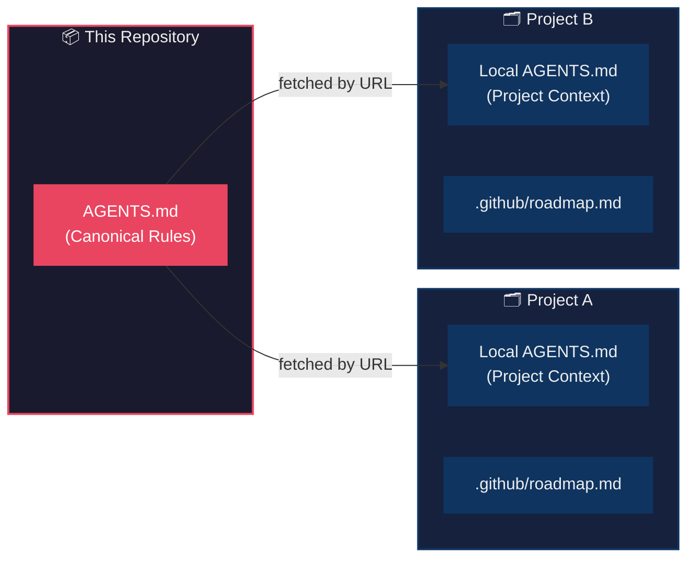

<div align="center">

# 🤖 Agent Instructions

### Give every AI coding agent the same high standards — automatically.

A **reference-based instruction system** for giving AI coding agents (GitHub Copilot, Claude, Cursor, etc.) consistent rules, conventions, and project context across **all** your projects.

[](https://github.com/LoneEngineer99/AgentInstructions)
[](#)
[](#)

</div>

---

## ✨ Why Agent Instructions?

Without shared rules, every AI agent session starts from scratch — inconsistent naming, missing security checks, forgotten documentation. **Agent Instructions** solves this by giving agents a single canonical rulebook they can fetch and follow on every task.

<table>
<tr>
<td width="50%">

### ❌ Without Agent Instructions
- Inconsistent naming across files
- Security best practices forgotten
- No documentation standards
- Every session starts from zero
- Agent "forgets" conventions

</td>
<td width="50%">

### ✅ With Agent Instructions
- Enforced naming conventions
- Built-in security checklists
- Mandatory documentation standards
- Cross-session memory via local `AGENTS.md`
- Consistent quality every time

</td>
</tr>
</table>

---

## 🏗️ How It Works

> **One canonical rulebook. Many projects. Always in sync.**



| Layer | File | Location | Purpose |
|:-----:|------|----------|---------|
| 🌐 | **`AGENTS.md`** | This repo | Canonical rules — fetched by URL, never copied |
| 📁 | **`AGENTS.md`** | Each project | Project-specific notes, architecture, status |
| 🗺️ | **`roadmap.md`** | Each project's `.github/` | Living project roadmap updated by agents |

---

## 📖 What's Inside the Canonical Rules

The canonical `AGENTS.md` is organized into **8 parts** covering everything an AI agent needs:

<table>
<tr><td>

| Part | Title | What It Covers |
|:----:|-------|----------------|
| **I** | 🧠 Agent Execution & Autonomy | Execution protocols, TODO management, error debugging, completion criteria |
| **II** | ⚙️ Software Engineering | SOLID, DRY, KISS, YAGNI, separation of concerns, security |
| **III** | 🏷️ Naming Conventions | C#, C/C++, PHP, JS/TS, SQL, CSS/SCSS |
| **IV** | 🗃️ Project Context | Database change rules, site templates, design references |
| **V** | 📝 Documentation & Evolution | Post-task reporting, agent work ethic, roadmap management |
| **VI** | 🚀 Initialization Protocol | 24 discovery questions + local `AGENTS.md` template |
| **VII** | 📋 Template Reference | Structure for each project's local `AGENTS.md` |
| **VIII** | 🤖 Custom Agents | 10 specialized agents and selection guide |

</td></tr>
</table>

<details>
<summary><strong>📂 What Each Project's Local <code>AGENTS.md</code> Contains</strong></summary>

<br>

- 🔗 Reference to the canonical rules URL
- 🤖 Reference to the custom agents index URL
- 📋 Project overview, tech stack, and architecture
- 🔨 Build, run, and test commands
- 🗄️ Database schema and migration details
- 📊 Current implementation status and progress
- ⚡ Project-specific rule overrides
- 📝 Notes and learnings from development

</details>

---

## 🤖 Custom Agents

This repository provides **10 specialized GitHub Copilot custom agents** in `.github/agents/`:

| Agent | Purpose |
|-------|---------|
| `code-formatter` | Naming conventions, inline comments, XML doc blocks |
| `agent-reporter` | Post-task reports with minimum 6 screenshots |
| `ui-designer` | Web UI components with design system compliance |
| `binary-analyst` | x64 reverse engineering and attack surface mapping |
| `test-engineer` | Focused unit tests for input validation and business logic |
| `project-initializer` | New project setup with AGENTS.md scaffolding |
| `database-architect` | Schema design, migrations, Dapper repositories |
| `security-auditor` | Code security review with prioritized findings |
| `api-designer` | REST API design, DTOs, versioning, OpenAPI docs |
| `documentation-writer` | README, AGENTS.md, roadmap, and ADR maintenance |

👉 **[View the full agent index](.github/agents/README.md)** for descriptions, selection guide, and remote usage instructions.

---

## 📁 Repository Structure

```
AgentInstructions/
├── 📜 AGENTS.md                        ★ Canonical rules — always fetched by URL
├── 🔀 base-copilot-instructions.md     Backwards-compat redirect → AGENTS.md
├── 🎨 site-templates.md                UI template & component reference guide
├── 🖼️ UI_Examples/
│   ├── ui-design-index.md              Design catalog with tokens & principles
│   └── *.jpg                           42 curated high-quality UI screenshots
└── 🤖 .github/agents/
    ├── README.md                       Agent index & selection guide
    ├── code-formatter.md               Naming, comments, XML doc blocks
    ├── agent-reporter.md               Post-task reports (6+ screenshots)
    ├── ui-designer.md                  Web UI design with Playwright MCP
    ├── binary-analyst.md               x64 RE with Radare2 + Ghidra MCP
    ├── test-engineer.md                Focused unit tests
    ├── project-initializer.md          New project setup wizard
    ├── database-architect.md           Schema, migrations, Dapper
    ├── security-auditor.md             Security vulnerability review
    ├── api-designer.md                 REST API design
    └── documentation-writer.md         README/AGENTS.md/roadmap
```

<details>
<summary><strong>📎 More About Supporting Files</strong></summary>

<br>

**`site-templates.md`** — UI template reference (remotely hosted, may receive updates):
- Reference guide for reusing UI components and pages from template libraries
- Critical rules for CSS/JS asset dependencies when copying components
- Template registry with detailed documentation for each UI template
- Always fetch the latest version by URL before use — do not rely on cached copies

**`UI_Examples/`** — UI design reference images and design index:
- 42 curated screenshots of modern UI design (dashboards, forms, cards, data tables, charts, modals, landing pages, and more)
- **`ui-design-index.md`** catalogs every image by component category and extracts design principles for color, typography, spacing, depth, and motion
- Includes ready-to-use **design tokens** (CSS custom properties) for colors, spacing, radius, shadows, and typography
- Agents must consult this index when building UI components (see §25)

**`roadmap.md`** — per-project living document:
- Each project maintains its own `.github/roadmap.md`
- Agents update it after every task with status, completed work, and next steps

</details>

---

## 🚀 Quick Start

Add AI agent instructions to **any project** in 3 steps:

### Step 1 — Create a Local `AGENTS.md`

Ask your AI agent:

> *"Create a local `AGENTS.md` using the template from §30 (Step 0) of the canonical rules at `https://raw.githubusercontent.com/LoneEngineer99/AgentInstructions/main/AGENTS.md`."*

Or manually: fetch the canonical rules, find the template in **§30 (Step 0)**, and copy it into an `AGENTS.md` file in your project root.

### Step 2 — Run the Initialization Wizard

The canonical `AGENTS.md` contains **§30 with 24 discovery questions**. Ask your AI agent to walk through them and populate the local `AGENTS.md` with your project's details.

### Step 3 — Commit & Go

```bash
git add AGENTS.md .github/roadmap.md
git commit -m "Add AI agent instructions for project"
```

<details>
<summary><strong>📌 Optional: Add backwards-compatible redirect</strong></summary>

<br>

For tools that auto-load `base-copilot-instructions.md`:

```bash
mkdir -p .github
curl -o .github/base-copilot-instructions.md \
  https://raw.githubusercontent.com/LoneEngineer99/AgentInstructions/main/base-copilot-instructions.md
```

</details>

> [!NOTE]
> **Forking?** Update the canonical rules URL in your local `AGENTS.md` files to point to your own fork.

---

## 💬 Instructing Agents to Use This System

Paste this into any AI agent conversation to activate the full system:

> *"Read the local `AGENTS.md` in this project for project-specific context. Then fetch the canonical rules from `https://raw.githubusercontent.com/LoneEngineer99/AgentInstructions/main/AGENTS.md` and follow the rules and standards defined there. After completing work, update the local `AGENTS.md` with progress and update `.github/roadmap.md` with status."*

GitHub Copilot and Claude will automatically load `AGENTS.md` when it exists in your project's directory — the redirect file will point them to the remote `AGENTS.md`.

---

<div align="center">

**Built to make AI agents work the way you want — every time.**

⭐ Star this repo if you find it useful!

</div>


